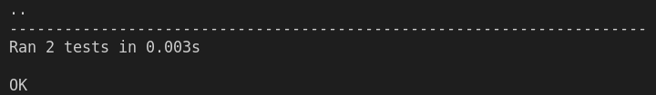

# Symetrical ciphers

### Course: Cryptography & Security
### Author: Cernei Ion

----
## Objectives:
1. Get familiar with the symmetric cryptography, stream and block ciphers.

2. Implement an example of a stream cipher.

3. Implement an example of a block cipher.

## Implementation description
* ### Stream cypher based on LFSR

LFSRs have long been used as pseudo-random number generators for use in stream ciphers. I created two cyphers, one that will be able to encrypt text, and the other images. At the base of the cypher there is the function that generates bits for the key given a register and a list of taps 

The register is the initial seed represented as a list of 0s and 1s. Taps correspond to indices in the binary number represented by the register. Bits on taps influence the next state of the key. 
```
cypher = Lfsr(register=[0, 1, 1, 0, 1, 0, 0, 0, 0, 1, 0, 1, 0, 0, 0, 1, 0, 0, 0, 0], taps=[16, 2])
```
Note that taps are indices in binary notation, i.e. read from right to left. Example: taps = [3] on a nine-bit register is located on (9-1)-3 = 5th position in the array.

To generate a key bit, all bits of the register are shifted left by 1 and new bit is appended to the right tail. The new bit is a result of xor of the bits located at taps before the shift.

```
def _generate_key_bit(self):
    new_bit = reduce(xor, [self.register[(len(self.register)-1)-t] for t in self.taps])
    key_bit = self.register[0]
    del self.register[0]
    self.register.append(new_bit)
    return key_bit
```
In order to use the cypher for strings, to create the key we just perform this function as many times as the length of the message requires. It is important to make sure that the initial state of the register is used for this function, in order to get the same results from the same imput.
```
def generate_key(self, key_length):
    self.register = self.origin.copy()
    key = []
    for i in range(key_length):
        key.append(self._generate_key_bit())
    return key
```
The decryption and encryption are basically the same function as it should be in a symetric cypher. In order to do it we xor each bit of the message with the bits from the key.
```
def process_bits(self, message):
    key = self.generate_key(len(message))
    processed_bits = []
    for i in range(len(message)):
        processed_bits.append(message[i] ^ key[i])
    return processed_bits

def encrypt(self, message):
    return self.process_bits(message)

def decrypt(self, encrypted_message):
    return self.process_bits(encrypted_message)
```
In order to use the cipher for images, 
The encrypt() method takes the RGB values of each pixel of a picture as arguments  and uses LFSR to return a new picture that is the result of transforming the argument picture using the linear feedback shift register as follows: for each pixel (x, y), extract the red, green, and blue components of the color (each component is an integer between 0 and 255). Then, xor the red component with a newly-generated 8-bit integer. Do the same for the green (using another new 8-bit integer) and, finally, the blue. Create a new color using the result of the xor operations, and set the pixel in the new picture to that color.
```
def generate_static_key(self, length):
    num = 0
    for _ in range(length):
        num *= 2
        num += self._generate_key_bit()
    return num

def encrypt_color(self, color):
    key = self.generate_static_key(8)
    encrypted_color = color ^ key
    return encrypted_color

def encrypt_pixel(self, img_from_array, x, y):
    R = img_from_array.getpixel((x, y))[0]
    G = img_from_array.getpixel((x, y))[1]
    B = img_from_array.getpixel((x, y))[2]

    newR = self.encrypt_color(R)
    newG = self.encrypt_color(G)
    newB = self.encrypt_color(B)
    return (newR, newG, newB)
```
Finally we can see that encryption and decryption work the same way.
```
def encrypt_image(self, img, img_from_array):
    self.register = self.origin.copy()
    for x in range(img.size[0]):
        for y in range(img.size[1]):
            new_pixel = self.encrypt_pixel(img_from_array, x, y)
            img.putpixel((x, y), new_pixel)
    return img

def decrypt_image(self, img, img_from_array):
    return self.encrypt_image(img, img_from_array)
```
[Link to images](../src/symetrical_cyphers/stream/images/)


* ### Blok cypher: DES
DES is a block cipher and encrypts data in blocks of size of 64 bits each, which means 64 bits of plain text go as the input to DES, which produces 64 bits of ciphertext. The same algorithm and key are used for encryption and decryption, with minor differences.

DES is based on the two fundamental attributes of cryptography: substitution (also called confusion) and transposition (also called diffusion). 
```
def sbox_substitute(self, input):
    output = ""
    input = hex_to_bin(input)
    for i in range(0, 48, 6):
        temp = input[i: i + 6]
        num = i // 6
        row = int(temp[0] + temp[5], 2)
        col = int(temp[1:5], 2)
        output += str(int(hex(S_BOX[num][row][col]), 16))
    return output

def transpose(self, sequence, input):
    output = ""
    input = hex_to_bin(input)
    for i in range(len(sequence)):
        output += input[sequence[i] - 1]
    output = bin_to_hex(output)
    return output  
```
DES consists of 16 steps, each of which is called a round. Each round performs the steps of substitution and transposition. 
```
def round(self, input, key, num):
    left = input[0:8]
    temp = input[8:16]
    right = temp
    temp = self.transpose(EP, temp)
    temp = xor(temp, key)
    temp = self.sbox_substitute(temp)
    temp = self.transpose(P, temp)
    left = xor(left, temp)
    return right + left
```
We have noted initial 64-bit key is transformed into a 56-bit key by discarding every 8th bit of the initial key. Thus, for each a 56-bit key is available. From this 56-bit key, a different 48-bit Sub Key is generated during each round using a process called key transformation. For this, the 56-bit key is divided into two halves, each of 28 bits. These halves are circularly shifted left by one or two positions, depending on the round.
```
def get_keys(self, key):
    keys = []
    # first key permutation
    key = self.transpose(PC1, key)
    for i in range(16):
        key = self.left_circular_shift(
            key[0:7], SHIFT_BITS[i]) + self.left_circular_shift(key[7:14], SHIFT_BITS[i])
        # second key permutation
        keys.append(self.transpose(PC2, key))
    return keys
```

Encryption and decryption takes several steps. 

In the first step, the 64-bit plain text block is handed over to an initial Permutation (IP) function. The initial permutation is performed on plain text.

Next, the initial permutation (IP) produces two halves of the permuted block; saying Left Plain Text (LPT) and Right Plain Text (RPT).

Now each LPT and RPT go through 16 rounds of the encryption process.

In the end, LPT and RPT are rejoined and a Final Permutation (FP) is performed on the combined block

The result of this process produces 64-bit ciphertext.
```
def encrypt(self, message, key):
    keys = self.get_keys(key)
    # initial transpose
    message = self.transpose(IP, message)
    # perform 16 rounds
    for i in range(16):
        message = self.round(message, keys[i], i)
    # swap 2 halves 32-bits of the message
    message = message[8:16] + message[0:8]
    # perform the final transpose
    message = self.transpose(IP1, message)
    return message
```

## Conclusions, Results
In this laboratory work I got familiar with symetric cryptogtaphy. As a way to do it , I implemented a stream and a block chypher. 

To demonstrate the implementation I created several test
```
def test_lfsr(self):
        cypher = LfsrStr(register=[0, 1, 1, 0, 1, 0, 0, 0, 0, 1, 0,
                                   1, 0, 0, 0, 1, 0, 0, 0, 0], taps=[16, 2])

        message = to_bits('Who am I')

        encrypted_message = cypher.encrypt(message)
        decrypted_message = cypher.decrypt(encrypted_message)

        assert ''.join(map(str, encrypted_message)) ==
            '0011111100111001011010111001111100001110110001111100101011001100'

        assert from_bits(decrypted_message) == 'Who am I'

    def test_des(self):
        message = b'I am Ion'.hex()
        key = 'AABB09182736C11D'

        cypher = Des()
        encrypted_message = cypher.encrypt(message, key)
        decrypted_message = cypher.decrypt(encrypted_message, key)

        assert hex_to_bin(encrypted_message) == 
            "0001111101001110001100100000001100110000011101001110101100110111"

        assert bytes.fromhex(decrypted_message).decode('utf-8') == "I am Ion"
```
The results were as follows:


