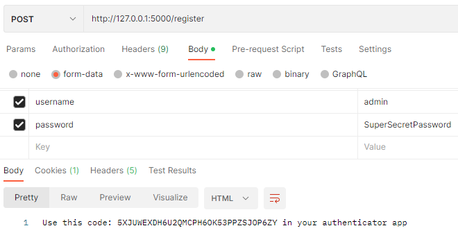
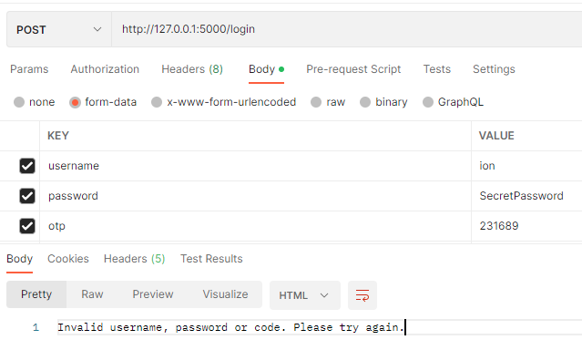
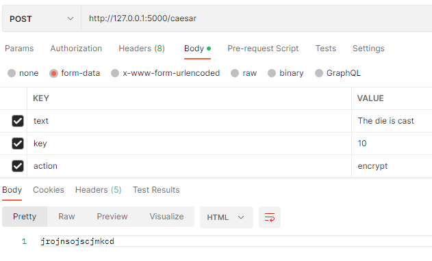
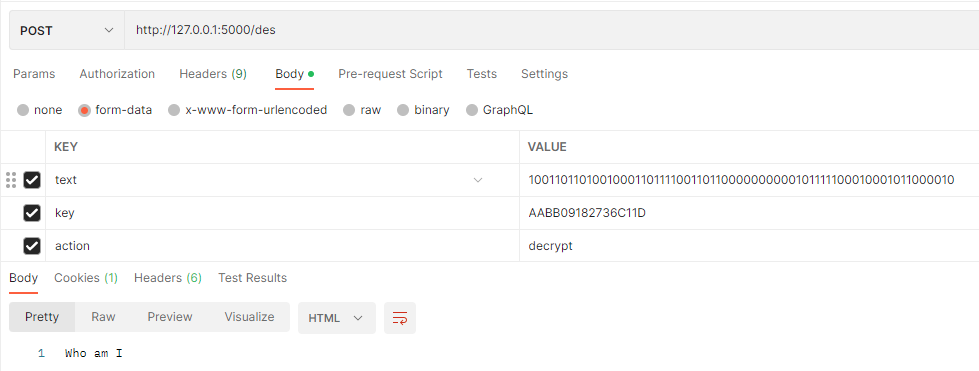
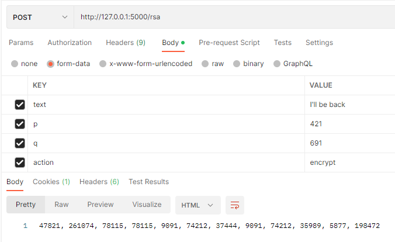
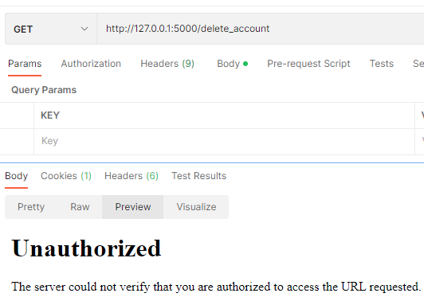
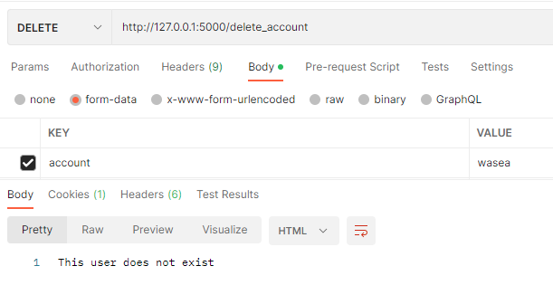

# Web Authentication & Authorization.

### Course: Cryptography & Security
### Author: Cernei Ion
----

## Objectives:
1. Take what you have at the moment from previous laboratory works and put it in a web service / serveral web services.

2. Your services should have implemented basic authentication and MFA (the authentication factors of your choice).

3. Your web app needs to simulate user authorization and the way you authorise user is also a choice that needs to be done by you.

4. As services that your application could provide, you could use the classical ciphers. Basically the user would like to get access and use the classical ciphers, but they need to authenticate and be authorized. 

## Implementation description
The implementation of the user authentication is based on a two factor authentication proccess.

First, the user has to register. A new user is provided with a unique token wich can be used in an authenticator app of choice (for example Google Authenticator) and added in the database (which is a dictionary in my case)
```
@app.route("/register", methods=['GET', 'POST'])
def register():
    if request.method == 'POST':
        username = request.form.get("username")
        password = request.form.get("password")
        if username in database:
            return 'Usernaem already exists, go to login page'
        else:
            user = User(username, password)
            database[username] = user
            return f'Use this code: {user.otp_seed} in your authenticator app'
    return 'this is the registration page'
```


It is important to mention that the token is assigned to each user individually at its creation, and the password is saved as a hash in the database
```
class User:
    def __init__(self, username, password):
        self.username = username
        self.password_hash = generate_password_hash(password)
        self.otp_seed = pyotp.random_base32()
        self.role = 'user'
        if username == 'admin':
            self.role = 'admin'
```
Then follows the login page. Here the user inputs his username, password and the unique code otp (one time password) provided by the authenticator app, if they are validated, the user is logged in (a session is created). 
```
@app.route("/login", methods=['GET', 'POST'])
def login():
    if request.method == 'POST':
        username = request.form.get("username")
        password = request.form.get("password")
        totp_instance = pyotp.TOTP(database[username].otp_seed)
        valid_otp = totp_instance.verify(request.form.get("otp"))

        if valid_otp and username in database and check_password_hash(database[username].password_hash, password):
            session['username'] = username
            return 'you can go to index page now'
        raise InvalidAuthentication
    return 'this is the login page'
```


An authenticated user then has acces to the app features, different cyphers which allow him to encryp and decrypt text. There are seven different cyphers available, some of them are:

- Caesar
```
@app.route("/caesar", methods=['GET', 'POST'])
def caesar():
    check_login_status(session)
    if request.method == 'POST':
        text = request.form.get("text")
        key = int(request.form.get("key"))
        action = request.form.get("action")
        cypher = Caesar(key)
        if action == 'encrypt':
            return cypher.encrypt(text)
        if action == 'decrypt':
            return cypher.decrypt(text)
    return 'This is a tool that performs encryption and decryption using Caesar cypher'
```


- Des
```
@app.route("/des", methods=['GET', 'POST'])
def des():
    check_login_status(session)
    if request.method == 'POST':
        text = request.form.get("text")
        key = request.form.get("key")
        action = request.form.get("action")
        cypher = Des(key)
        if action == 'encrypt':
            return cypher.encrypt(text)
        if action == 'decrypt':
            return cypher.decrypt(text)
    return 'This is a tool that performs encryption and decryption using Des cypher'
```


- RSA
```
@app.route("/rsa", methods=['GET', 'POST'])
def rsa():
    check_login_status(session)
    if request.method == 'POST':
        text = request.form.get("text")
        p = request.form.get("p")
        q = request.form.get("q")
        action = request.form.get("action")
        cypher = Rsa(int(p), int(q))
        if action == 'encrypt':
            return cypher.encrypt(text)
        if action == 'decrypt':
            return cypher.decrypt(text)
    return 'This is a tool that performs encryption and decryption using RSA cypher'
```


For the authorization of the users, each of them has a role. The roles are 'admin' and 'user'. 
```
@app.route("/delete_account", methods=['GET', 'DELETE'])
def delete_account():
    check_login_status(session)
    validate_admin(database[session['username']])

    if request.method == 'DELETE':
        username = request.form.get("account")
        if username not in database:
            return 'This user does not exist', 404
        del database[username]
        return f'Account of user "{username}" was succesfuly deleted'
    return 'Admin page'
```
In order to limit acces to this page it is checked if the current user has admin role
```
def validate_admin(user):
    if user.role != 'admin':
        raise Unauthorized
    pass
```


The admin has acces to the delete_account page where he is able to delete user accounts. 

