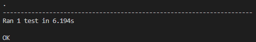

# Asymmetrical cyphers

### Course: Cryptography & Security
### Author: Cernei Ion

----
## Objectives:
1. Get familiar with the asymmetric cryptography mechanisms.

2. Implement an example of an asymmetric cypher.


## Implementation description
* ### RSA
The RSA algorithm involves three steps: key generation, encryption, and decryption.
The keys for the RSA algorithm are generated in the following way:

Choose two large prime numbers p and q.
```
cypher = Rsa(421, 691)
```
Compute n = pq and  φ(n) = (p − 1)(q − 1)

Choose an integer e such that 1 < e < φ(n) and gcd(e, φ(n)) = 1; that is, e and φ(n) are coprime.

Determine d as d ≡ e^(−1) mod phi(n); that is, d is the modular multiplicative inverse of e modulo phi(n)

```
def generate_keypair(self, p, q):
    phi = (p-1) * (q-1)

    for e in range(phi, 0, -1):
        if gcd(e, phi) == 1:
            break

    d = pow(e, -1, phi)
    return (e, d)
```
In order to encrypt the message the formula with the public key is used 
c ≡ m^e (mod n)

```
def encrypt(self, message):
    e = self.public_key
    encrypted_message = []
    for character in message:
        ascii_value = ord(character)
        encrypted_character = pow(ascii_value, e) % self.n
        encrypted_message.append(encrypted_character)
    return encrypted_message
```
The decryption procces is similar, but the private key is used instead, m ≡ c^d (mod n) 
```
def decrypt(self, encrypted_message):
        d = self.private_key
        decrypted_message = []
        for character in encrypted_message:
            ascii_value = pow(character, d) % self.n
            decrypted_character = chr(ascii_value)
            decrypted_message.append(decrypted_character)
        return decrypted_message
```

## Conclusions, Results
In this laboratory work I got familiar with asymmetric cyphers. I implemented a chypher based on RSA. The prime numbers that were used are too small for a secure encryption but larger numbers take more computation time.

To demonstrate the implementation a test was created:
```
def test_rsa(self):
        cypher = Rsa(421, 691)
        message = ('you shall not pass')
        encrypted_message = cypher.encrypt(message)
        decrypted_message = cypher.decrypt(encrypted_message)

        assert ''.join(map(str, encrypted_message)) == '2692731310411839959091149250251753598978115781159091208927131041102822909121039135989149250149250'

        assert ''.join(map(str, decrypted_message)) == 'you shall not pass'
```
The results were as follows:


