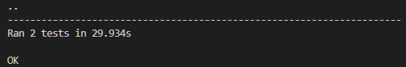

# Hash functions and Digital Signatures.

### Course: Cryptography & Security
### Author: Cernei Ion

----
## Objectives:
1. Get familiar with the hashing techniques/algorithms.
2. Use an appropriate hashing algorithms to store passwords in a local DB.
3. Use an asymmetric cipher to implement a digital signature process for a user message.

## Implementation description
In the following implementations, for hashing the hashlib library from python was used. The hash function is based on the sha256 algotithm.

* ### User management serivce.
For the implementation of the user management service, two functions were needed.

First create the user. This function takes as parameters the username and the password and creates a new user by adding it into a dictyonary with username as key and pasword hash as value.   

```
def create_user(self, username, password):
    if username in self.database:
        return
    self.database[username] = hash(password)
```
The second step is user validation. The function takes as parameters the username and password input. Then it checks if the hash of the password input is equal to the hash of the password from the database.
```
def validate_user(self, username_input, password_input):
    if username_input in self.database:
        if self.database[username_input] == hash(password_input):
            return True
    return False
```

* ### Digital signature serivce.
For the implementation of the user management service, two functions were needed.

Frist, sign the message. This function takes as parameter the message itself, then it creates a signature which is the hash of the message. Finally, it encrypts both the message and the signature with the [RSA cypher algorithm](../src/cyphers/asymmetrical_cyphers/rsa.py).
```
def sign(self, message):
    signature = hash(message)
    encrypted_signature = self.cypher.encrypt(signature)
    encrypted_message = self.cypher.encrypt(message)
    return (encrypted_message, encrypted_signature)
```
The second step is message validation. This function takes as parameters the encrypted message and signature. After decrypting them, it checks if the recieved signature is the same as the hash of the recieved message.
```
def validate(self, encrypted_message, encrypted_signature):
    recieved_message = ''.join(self.cypher.decrypt(encrypted_message))
    recieved_signature = ''.join(self.cypher.decrypt(encrypted_signature))
    if recieved_signature == hash(recieved_message):
        return True
    return False
```

## Conclusions, Results
In this laboratory work I got familiar with the hashing techniques, algorithms. I implemented two services: User Management and Digital Signature. 

To demonstrate the implementation two tests were performed:

The first one tests the user validation fnction.
```
def test_user_management(self):
    database = {}
    user_manager = UserManagementService(database)
    user_manager.create_user(
        username='70m_470', password='5up3r_s3cRe7_p422w0rd')

    assert user_manager.validate_user('70m_470', '5up3r_s3cRe7_p422w0rd') == True
```
The second one tests the digital signature validation function.
```
def test_digital_signature(self):
    message_signer = DigitalSignatureService()
    message = 'This message is certainly mine'
    signed_message, signature = message_signer.sign(message)

    assert message_signer.validate(signed_message, signature) == True
```
The results were as follows:


